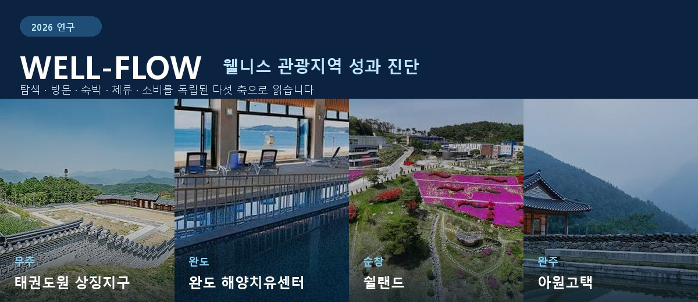
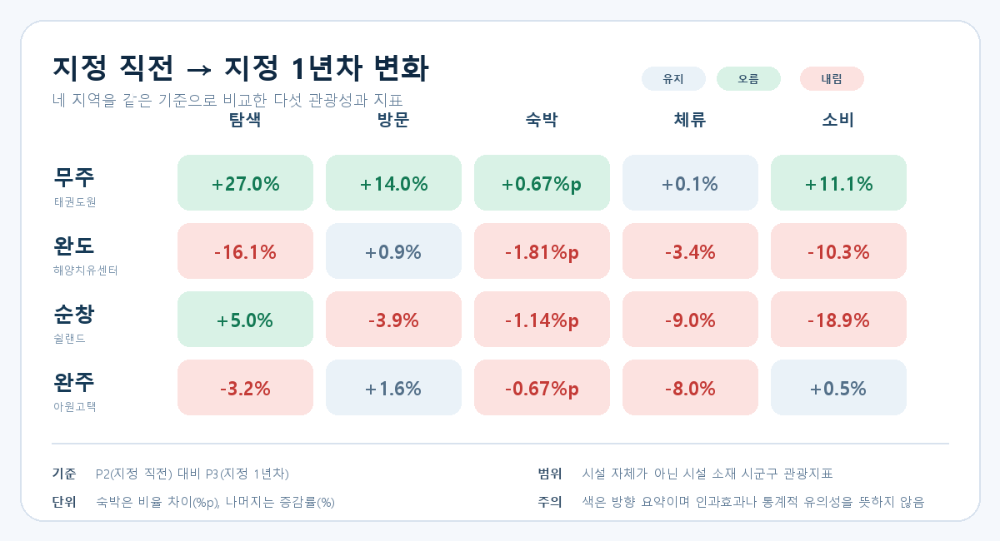

<p align="center">
  
</p>

<p align="center">
  <a href="https://well-flow-dashboard.vercel.app/"><strong>대시보드 바로 보기</strong></a>
  &nbsp;·&nbsp;
  <a href="2026%20한국관광%20데이터랩%20활용%20경진대회%20제출용%20연구보고서.pdf"><strong>최종 보고서 PDF</strong></a>
  &nbsp;·&nbsp;
  <a href="PROJECT.md"><strong>분석 설계</strong></a>
</p>

## 프로젝트 소개

추천 웰니스 관광지가 있는 지역의 관광 흐름을 **탐색·방문·숙박·체류·소비**
다섯 축으로 진단합니다. 무주·완도·순창·완주를 각 지역의 신규 선정 시점에 맞춰
4개 연간 구간으로 비교하고, 결과를 지도형 대시보드로 제공합니다.

| 탐색 | 방문 | 숙박 | 체류 | 소비 |
|:---:|:---:|:---:|:---:|:---:|
| 티맵 숙박검색 | KT 외지인 방문 | KT 숙박자 비율 | KT 평균 체류시간 | 신한카드 관광소비 |

다섯 축은 앞뒤로 이어지는 전환 단계가 아니라, 서로 다른 자료로 관측한 **독립된
관광성과 지표**입니다.

## 한눈에 보는 결과

<p align="center">
  
</p>

- **무주**는 지정 1년차에 탐색·방문·숙박·소비가 함께 올랐습니다. 코로나19 회복기가
  포함되어 지정 효과로 단정하지 않습니다.
- **완도**는 방문이 유지된 가운데 탐색·숙박·소비가 낮아져 서로 다른 지표의 움직임을
  함께 점검할 필요가 있습니다.
- **순창**은 탐색이 늘었지만 소비 감소가 가장 커, 소비를 우선 확인 축으로 봅니다.
- **완주**는 방문과 소비가 유지된 반면 숙박과 체류가 낮아졌습니다. 아원고택 자체가
  아닌 완주군 전체 지표입니다.

## 분석 범위

| 지역 | 관광지 | 신규 선정 발표 | 분석 구간 |
|---|---|---:|---|
| 전북 무주군 | 태권도원 상징지구 | 2022-04-19 | 2020.04–2024.03 |
| 전남 완도군 | 완도 해양치유센터 | 2024-04-24 | 2022.04–2026.03 |
| 전북 순창군 | 쉴랜드 | 2024-04-24 | 2022.04–2026.03 |
| 전북 완주군 | 아원고택 | 2024-04-24 | 2022.04–2026.03 |

각 지역은 기준월부터 12개월을 지정 1년차(P3)로 두고, 지정 2년 전(P1)·지정
직전(P2)·지정 1년차(P3)·지정 2년차(P4)를 비교합니다.

> **해석 기준**
> 수치는 관광지 자체의 방문객이나 매출이 아니라 **시설 소재 시군구 전체 관광시장**을
> 보여줍니다. 지정 시점 분석(ITS)은 구조변화를 탐색하며, 비교 지역이 없어 인과효과로
> 해석하지 않습니다. 정책 방향은 자동 처방이 아니라 진단 규칙에 따른 후속 확인
> 순서입니다.

## 결과물

| 결과물 | 내용 |
|---|---|
| [웹 대시보드](https://well-flow-dashboard.vercel.app/) | 지도에서 지역을 선택해 9개 진단 화면과 상세 근거 확인 |
| [최종 보고서 PDF](<2026 한국관광 데이터랩 활용 경진대회 제출용 연구보고서.pdf>) | 연구 배경, 방법, 결과와 정책 제안 |
| [최종 보고서 DOCX](<2026 한국관광 데이터랩 활용 경진대회 제출용 연구보고서.docx>) | 제출용 편집 원본 |
| [분석 설계](PROJECT.md) | 지표 정의, 계산 원칙, ITS와 산출물 설명 |
| [숙박 공급 방법](docs/숙박_공급_반영방법.md) | 인허가 자료, 반경 객실 수와 시설 자체 숙박 반영 방식 |

<details>
<summary><strong>저장소 구조와 재현 방법 보기</strong></summary>

```text
.
├── vercel-dashboard/               # 현재 Next.js 대시보드
├── streamlit-dashboard/            # 이전 Streamlit 화면 보관
├── scripts/                        # 분석·검증·웹 데이터 생성 코드
├── output/
│   ├── 4개_웰니스관광지_성과분석/   # 핵심 분석 결과
│   └── 대시보드_보조데이터/          # 숙박 공급 등 보조 결과
├── data/                           # 분석 원자료
├── docs/                           # 방법론과 README 이미지
├── assets/                         # 지도 경계 데이터
└── 웰니스관광지_사진/                # 관광지 사진
```

Python 분석과 대시보드 데이터를 생성합니다.

```bash
python -m venv .venv
source .venv/bin/activate
pip install -r requirements.txt

python scripts/analyze_four_sites_by_designation.py
python scripts/analyze_four_site_lodging_supply.py
python scripts/build_vercel_dashboard_data.py
```

Next.js 대시보드를 실행합니다.

```bash
cd vercel-dashboard
npm ci
npm run dev
```

Vercel의 **Root Directory**는 `vercel-dashboard`로 설정합니다. 통합 원자료는
`data/한국관광데이터랩 데이터 통합.zip`에 두며, 다운로드 원본과 환경 파일은 Git에서
제외합니다.

</details>

## 데이터 출처

- **한국관광 데이터랩**: KT 이동통신, 신한카드 관광소비, 티맵 내비게이션
- **공공데이터포털**: 전국 숙박업 인허가 현황
- **한국관광공사 국문관광정보**: 관광지 위치 확인용 좌표

각 데이터의 이용 조건은 원 제공기관의 정책을 따릅니다.
